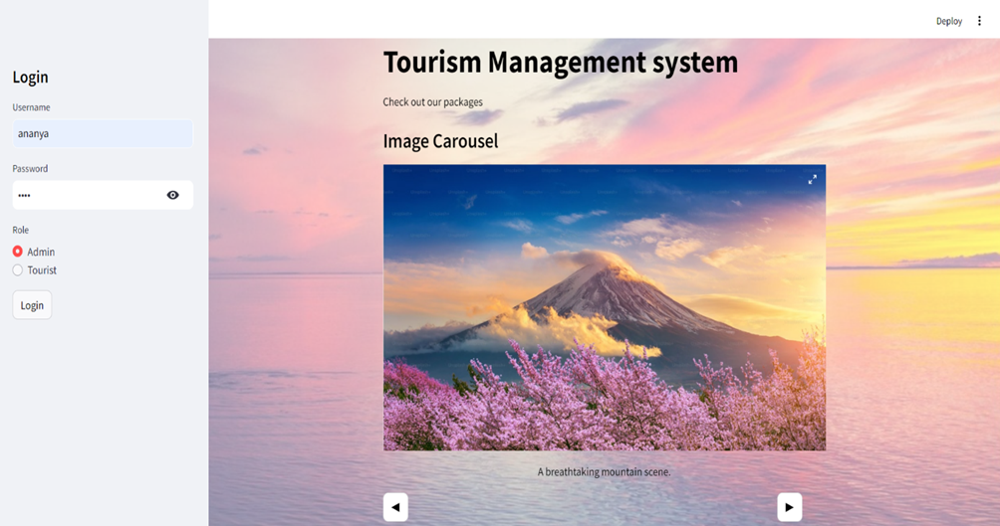
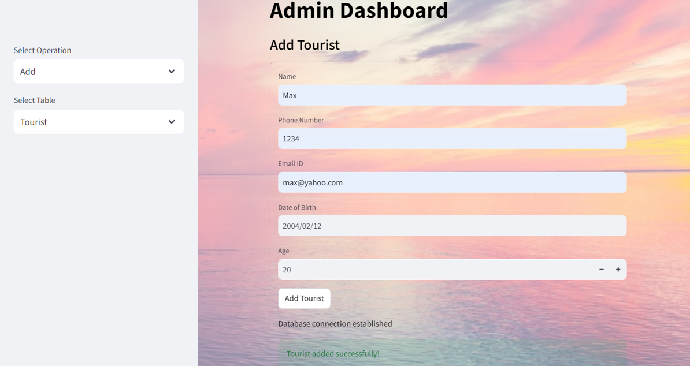
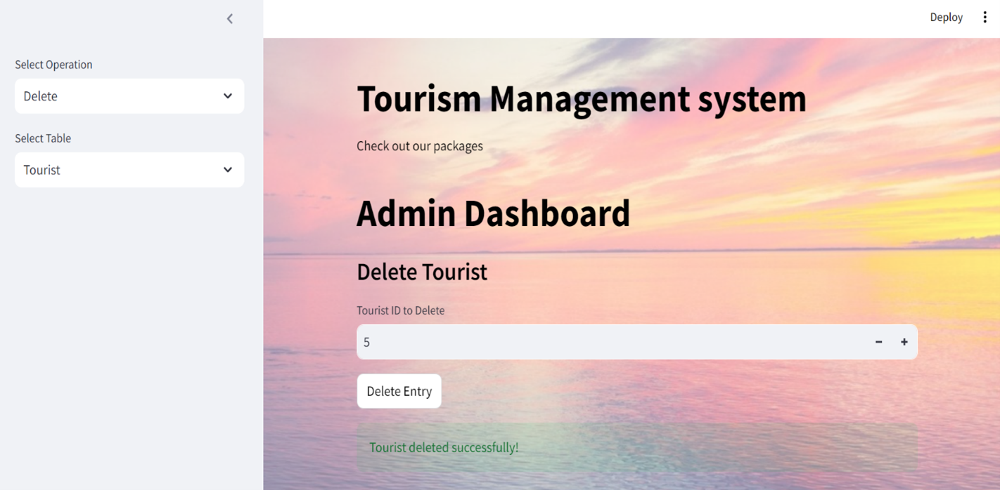
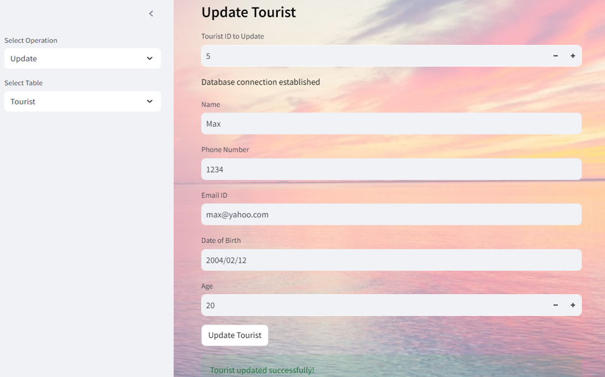
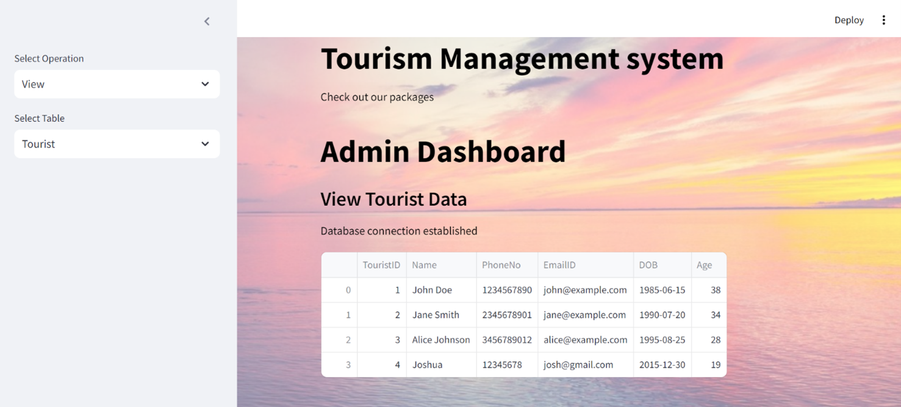

# 🌍 Tourism Management System  

## 📌 Overview  

The **Tourism Management System** is a web application built using **Streamlit** and **MySQL**, designed to facilitate tourists in managing their travel experiences. The application allows users to log in, view **tour packages, reservations, payments, accommodation,** and **transportation** options.  

---

## 🚀 Features  

### 🔑 User Authentication  
- Secure login system for both **Admin** and **Tourist** roles.  

### 🏠 Tourist Dashboard  
- Personalized dashboard for tourists to view their data.  

### 📊 Data Retrieval  
- Uses **SQL queries** to fetch user-specific data from a MySQL database.  

### 🖼️ Image Carousel  
- Displays images related to tourism destinations for a visual experience.  

### 📱 Responsive Design  
- User-friendly interface optimized for different devices.  

### 🔍 Search Functionality  
- Users can search for **specific tour packages** or **reservations**.  

### 📅 Booking Management  
- **Admins** can create, update, or delete reservations.  

### 💳 Payment Processing  
- Secure handling of **payment data** and **transaction history**.  

### 📝 Feedback System  
- Users can provide feedback on tours and accommodations to improve services.  

### 🌎 Multi-Language Support  
- Supports multiple languages for a broader audience.  

---

## 🛠️ Tech Stack  

- **Frontend**: 🖥️ **Streamlit**  
- **Backend**: 🐍 **Python**  
- **Database**: 🗄️ **MySQL**  
- **Libraries Used**:  
  - `streamlit` → Web interface  
  - `pandas` → Data manipulation  
  - `pillow` → Image handling  
  - `mysql-connector-python` → Database interaction  

---

## 📌 Output Preview  

### 🔑 **Login Page**  
  

### ➕ **Adding Entries**  
  

### ❌ **Deleting Entries**  
  

### ✏️ **Updating Entries**  
  

### 👀 **Viewing Entries**  
  
